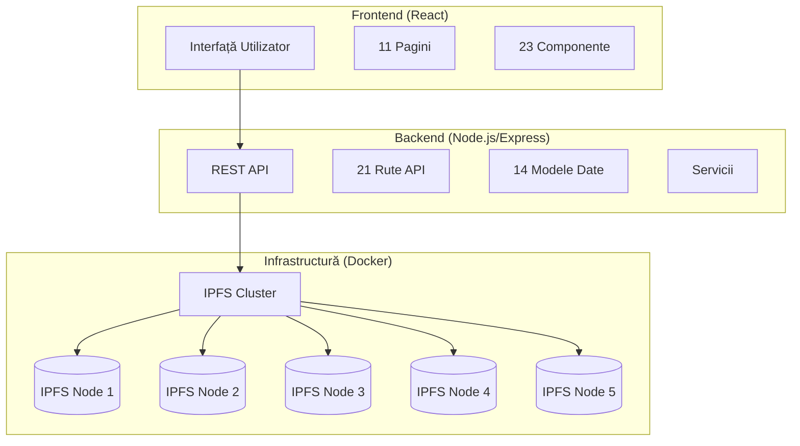
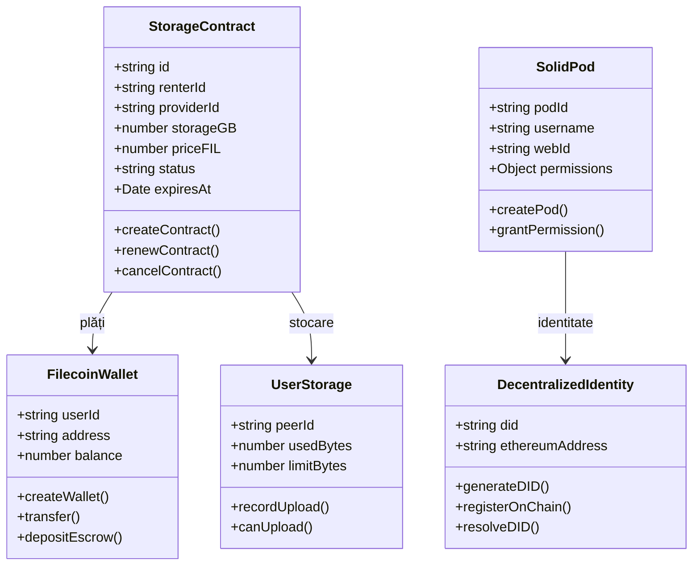

# Software Requirements Specification (SRS)
## Distributed Cloud Storage System

---

**Versiune:** 1.0  
**Data:** 21 Decembrie 2025  
**Autor:** Diana Negut  
**Proiect:** Sistem de Stocare Cloud Distribuită bazat pe IPFS

---

## 1. Introducere

### 1.1 Scop
Acest document definește cerințele software pentru sistemul **Distributed Cloud Storage** - o platformă de stocare distribuită bazată pe tehnologia IPFS (InterPlanetary File System) cu integrare blockchain pentru identitate descentralizată și contracte de stocare.

### 1.2 Domeniu de Aplicare
Sistemul oferă:
- Stocare distribuită de fișiere cu replicare automată
- Identitate descentralizată (DID - Decentralized Identifiers)
- Contracte de stocare cu plăți în Filecoin
- Personal Online Data Stores (Solid PODs)
- Monitorizare și failover automat

### 1.3 Definiții și Acronime

| Termen | Definiție |
|--------|-----------|
| IPFS | InterPlanetary File System - protocol de stocare distribuită |
| CID | Content Identifier - identificator unic bazat pe hash |
| DID | Decentralized Identifier - identitate descentralizată |
| POD | Personal Online Datastore (Solid) |
| FIL | Filecoin - criptomonedă pentru plăți stocare |
| Cluster | Grup de noduri IPFS interconnectate |

### 1.4 Referințe
- Specificația IPFS: https://docs.ipfs.tech/
- Solid Protocol: https://solidproject.org/
- W3C DID Specification: https://www.w3.org/TR/did-core/
- Filecoin: https://filecoin.io/

---

## 2. Descriere Generală

### 2.1 Perspectiva Produsului
Sistemul Distributed Cloud este o soluție completă de stocare distribuită care combină:



### 2.2 Funcționalități Principale

| Modul | Descriere |
|-------|-----------|
| **Stocare Fișiere** | Upload, download, ștergere fișiere cu replicare automată |
| **Cluster Management** | Administrare 5 noduri IPFS cu load balancing |
| **Identitate DID** | Generare și verificare identități descentralizate |
| **Contracte Stocare** | Crearea și gestionarea contractelor de stocare |
| **Solid PODs** | Management Personal Online Datastores |
| **Plăți Filecoin** | Sistem intern de plăți și escrow |
| **Integritate Date** | Verificare periodică și auto-reparare |
| **Failover** | Detecție și recuperare automată din erori |

### 2.3 Clase de Utilizatori

1. **Utilizator Final** - încarcă și accesează fișiere
2. **Provider Stocare** - oferă spațiu de stocare în rețea
3. **Administrator** - gestionează infrastructura și utilizatorii

### 2.4 Mediul de Operare
- **Server:** Node.js v18+, Docker
- **Client:** Browser web modern (Chrome, Firefox, Edge)
- **Sistem de Operare:** Windows, Linux, macOS

---

## 3. Cerințe Funcționale

### 3.1 Modul Autentificare (FR-AUTH)

| ID | Cerință | Prioritate |
|----|---------|------------|
| FR-AUTH-01 | Sistemul trebuie să permită înregistrarea utilizatorilor | Înaltă |
| FR-AUTH-02 | Sistemul trebuie să autentifice utilizatorii prin API Key | Înaltă |
| FR-AUTH-03 | Sistemul trebuie să gestioneze sesiuni utilizator | Înaltă |
| FR-AUTH-04 | Sistemul trebuie să ofere logout securizat | Medie |

### 3.2 Modul Stocare Fișiere (FR-FILES)

| ID | Cerință | Prioritate |
|----|---------|------------|
| FR-FILES-01 | Sistemul trebuie să permită upload fișiere până la 100MB | Înaltă |
| FR-FILES-02 | Sistemul trebuie să genereze CID unic pentru fiecare fișier | Înaltă |
| FR-FILES-03 | Sistemul trebuie să replice fișierele pe minimum 2 noduri | Înaltă |
| FR-FILES-04 | Sistemul trebuie să permită descărcare fișiere prin CID | Înaltă |
| FR-FILES-05 | Sistemul trebuie să permită ștergerea fișierelor (unpin) | Medie |
| FR-FILES-06 | Sistemul trebuie să stocheze metadate (nume, dimensiune, tip) | Înaltă |
| FR-FILES-07 | Sistemul trebuie să suporte criptare fișiere client-side | Medie |
| FR-FILES-08 | Sistemul trebuie să ofere acces la fișiere prin multiple gateway-uri | Înaltă |

### 3.3 Modul Cluster IPFS (FR-CLUSTER)

| ID | Cerință | Prioritate |
|----|---------|------------|
| FR-CLUSTER-01 | Sistemul trebuie să gestioneze 5 noduri IPFS | Înaltă |
| FR-CLUSTER-02 | Sistemul trebuie să verifice periodic sănătatea nodurilor | Înaltă |
| FR-CLUSTER-03 | Sistemul trebuie să afișeze lista peers conectați | Înaltă |
| FR-CLUSTER-04 | Sistemul trebuie să redistribuie fișierele la căderea unui nod | Înaltă |
| FR-CLUSTER-05 | Sistemul trebuie să suporte factor de replicare configurabil (2-5) | Medie |

### 3.4 Modul Identitate Descentralizată (FR-DID)

| ID | Cerință | Prioritate |
|----|---------|------------|
| FR-DID-01 | Sistemul trebuie să genereze DID-uri unice pentru utilizatori | Înaltă |
| FR-DID-02 | Sistemul trebuie să înregistreze DID-uri pe blockchain | Medie |
| FR-DID-03 | Sistemul trebuie să rezolve DID-uri din blockchain | Medie |
| FR-DID-04 | Sistemul trebuie să emită Verifiable Credentials | Scăzută |

### 3.5 Modul Contracte Stocare (FR-CONTRACTS)

| ID | Cerință | Prioritate |
|----|---------|------------|
| FR-CONTRACTS-01 | Sistemul trebuie să permită crearea contractelor de stocare | Înaltă |
| FR-CONTRACTS-02 | Sistemul trebuie să calculeze prețul bazat pe spațiu și durată | Înaltă |
| FR-CONTRACTS-03 | Sistemul trebuie să gestioneze stări contract (pending, active, expired) | Înaltă |
| FR-CONTRACTS-04 | Sistemul trebuie să asocieze fișiere la contracte | Înaltă |
| FR-CONTRACTS-05 | Sistemul trebuie să notifice la expirarea contractelor | Medie |
| FR-CONTRACTS-06 | Sistemul trebuie să permită reînnoirea contractelor | Medie |

### 3.6 Modul Plăți Filecoin (FR-FILECOIN)

| ID | Cerință | Prioritate |
|----|---------|------------|
| FR-FILECOIN-01 | Sistemul trebuie să creeze wallet-uri FIL pentru utilizatori | Înaltă |
| FR-FILECOIN-02 | Sistemul trebuie să afișeze balanța FIL | Înaltă |
| FR-FILECOIN-03 | Sistemul trebuie să proceseze transferuri FIL între utilizatori | Înaltă |
| FR-FILECOIN-04 | Sistemul trebuie să gestioneze escrow pentru contracte | Înaltă |
| FR-FILECOIN-05 | Sistemul trebuie să elibereze/refund escrow la finalizare | Înaltă |

### 3.7 Modul Solid PODs (FR-SOLID)

| ID | Cerință | Prioritate |
|----|---------|------------|
| FR-SOLID-01 | Sistemul trebuie să creeze POD-uri pentru utilizatori | Înaltă |
| FR-SOLID-02 | Sistemul trebuie să genereze WebID unic pentru fiecare POD | Înaltă |
| FR-SOLID-03 | Sistemul trebuie să gestioneze permisiuni (read, write, control) | Înaltă |
| FR-SOLID-04 | Sistemul trebuie să stocheze documente în POD-uri | Înaltă |
| FR-SOLID-05 | Sistemul trebuie să suporte partajare resurse publice | Medie |

### 3.8 Modul Provider Stocare (FR-PROVIDER)

| ID | Cerință | Prioritate |
|----|---------|------------|
| FR-PROVIDER-01 | Sistemul trebuie să permită înregistrarea provider-ilor | Înaltă |
| FR-PROVIDER-02 | Sistemul trebuie să afișeze spațiul disponibil al provider-ilor | Înaltă |
| FR-PROVIDER-03 | Sistemul trebuie să verifice periodic disponibilitatea provider-ilor | Înaltă |
| FR-PROVIDER-04 | Sistemul trebuie să suspende provider-ii inactivi | Medie |

### 3.9 Modul Integritate Date (FR-INTEGRITY)

| ID | Cerință | Prioritate |
|----|---------|------------|
| FR-INTEGRITY-01 | Sistemul trebuie să verifice periodic integritatea fișierelor | Înaltă |
| FR-INTEGRITY-02 | Sistemul trebuie să detecteze corupția datelor | Înaltă |
| FR-INTEGRITY-03 | Sistemul trebuie să repare automat fișierele corupte | Înaltă |
| FR-INTEGRITY-04 | Sistemul trebuie să monitorizeze factorul de replicare | Medie |

### 3.10 Modul Failover (FR-FAILOVER)

| ID | Cerință | Prioritate |
|----|---------|------------|
| FR-FAILOVER-01 | Sistemul trebuie să detecteze nodurile căzute | Înaltă |
| FR-FAILOVER-02 | Sistemul trebuie să redirecționeze traficul la noduri funcționale | Înaltă |
| FR-FAILOVER-03 | Sistemul trebuie să încerce reconectarea automată | Medie |

---

## 4. Cerințe Non-Funcționale

### 4.1 Performanță (NFR-PERF)

| ID | Cerință | Metrică |
|----|---------|---------|
| NFR-PERF-01 | Timpul de răspuns API | < 500ms pentru operații simple |
| NFR-PERF-02 | Upload throughput | > 10 MB/s pentru fișiere mari |
| NFR-PERF-03 | Download throughput | > 20 MB/s din cluster |
| NFR-PERF-04 | Latența health check | < 2 secunde per nod |

### 4.2 Disponibilitate (NFR-AVAIL)

| ID | Cerință | Metrică |
|----|---------|---------|
| NFR-AVAIL-01 | Uptime sistem | 99.9% (max 8.76 ore downtime/an) |
| NFR-AVAIL-02 | Toleranță la erori | Funcționare cu minimum 3 noduri din 5 |
| NFR-AVAIL-03 | Recovery time | < 30 secunde pentru failover |

### 4.3 Securitate (NFR-SEC)

| ID | Cerință | Descriere |
|----|---------|-----------|
| NFR-SEC-01 | Autentificare API | Toate rutele protejate necesită API Key valid |
| NFR-SEC-02 | Criptare transport | HTTPS pentru toate comunicațiile externe |
| NFR-SEC-03 | Rețea privată IPFS | Swarm key pentru izolare noduri cluster |
| NFR-SEC-04 | Criptare fișiere | Suport AES-256 pentru fișiere sensibile |
| NFR-SEC-05 | Validare input | Sanitizare toate datele de intrare |

### 4.4 Scalabilitate (NFR-SCALE)

| ID | Cerință | Descriere |
|----|---------|-----------|
| NFR-SCALE-01 | Noduri cluster | Suport extindere la 10+ noduri |
| NFR-SCALE-02 | Stocare | Scalare orizontală prin adăugare noduri |
| NFR-SCALE-03 | Utilizatori concurenți | Suport 100+ utilizatori simultan |

### 4.5 Mentenabilitate (NFR-MAINT)

| ID | Cerință | Descriere |
|----|---------|-----------|
| NFR-MAINT-01 | Logging | Logare toate operațiile importante |
| NFR-MAINT-02 | Monitorizare | Dashboard status în timp real |
| NFR-MAINT-03 | Documentație | README și comentarii cod |

---

## 5. Interfețe Sistem

### 5.1 Arhitectura API REST

**Base URL:** `http://localhost:3001/api`

#### 5.1.1 Autentificare
```
Header: x-api-key: <API_KEY>
```

#### 5.1.2 Endpoints Principale

| Endpoint | Metodă | Descriere |
|----------|--------|-----------|
| `/health` | GET | Verificare status backend |
| `/docker-cluster/status` | GET | Status complet cluster |
| `/docker-cluster/peers` | GET | Lista peers conectați |
| `/docker-cluster/add` | POST | Upload fișier în cluster |
| `/docker-cluster/pins` | GET | Lista fișiere pinuite |
| `/docker-cluster/download/:cid` | GET | Descarcă fișier |
| `/docker-cluster/pin/:cid` | DELETE | Șterge fișier |
| `/auth/login` | POST | Autentificare utilizator |
| `/auth/register` | POST | Înregistrare utilizator |
| `/did/generate` | POST | Generare DID nou |
| `/did/resolve/:address` | GET | Rezolvare DID |
| `/solid/pods` | GET | Lista POD-uri |
| `/solid/pods` | POST | Creare POD nou |
| `/filecoin/wallet` | GET | Informații wallet |
| `/filecoin/transfer` | POST | Transfer FIL |
| `/storage-contracts` | GET | Lista contracte |
| `/storage-contracts` | POST | Creare contract |
| `/storage-providers` | GET | Lista providers |
| `/integrity/verify` | POST | Verificare integritate |
| `/failover/status` | GET | Status failover |

### 5.2 Interfață Utilizator (Frontend)

#### 5.2.1 Pagini Principale

| Pagină | Descriere |
|--------|-----------|
| `LoginPage` | Autentificare și înregistrare |
| `Dashboard` | Sumar statistici și activitate |
| `FilesPage` | Gestionare fișiere (upload, download, ștergere) |
| `ClusterPage` | Vizualizare status cluster și peers |
| `ContractsPage` | Gestionare contracte stocare |
| `MarketplacePage` | Piață pentru oferte stocare |
| `ProviderPage` | Configurare provider stocare |
| `SolidPodsPage` | Gestionare POD-uri Solid |
| `NetworkPage` | Informații rețea și noduri |
| `MonitoringDashboard` | Monitorizare în timp real |

### 5.3 Interfață Infrastructură

#### 5.3.1 Containere Docker

| Container | Port Host | Descriere |
|-----------|-----------|-----------|
| ipfs-node-1 | 4001, 5001, 8080 | Nod IPFS principal |
| ipfs-node-2 | 4002, 5002, 8081 | Nod IPFS secundar |
| ipfs-node-3 | 4003, 5003, 8082 | Nod IPFS secundar |
| ipfs-node-4 | 4004, 5004, 8083 | Nod IPFS secundar |
| ipfs-node-5 | 4005, 5005, 8084 | Nod IPFS secundar |
| cluster-node-1 | 9094, 9096 | Cluster IPFS principal |
| cluster-node-2 | 9194, 9196 | Cluster IPFS secundar |
| cluster-node-3 | 9294, 9296 | Cluster IPFS secundar |
| cluster-node-4 | 9394, 9396 | Cluster IPFS secundar |
| cluster-node-5 | 9494, 9496 | Cluster IPFS secundar |
| backend-server | 3001 | Server API REST |

---

## 6. Modele de Date

### 6.1 Diagrama Clase



### 6.2 Entități Principale

#### 6.2.1 StorageContract
```javascript
{
  id: "contract-uuid",
  renterId: "user-id",
  providerId: "provider-id",
  storageGB: 10,
  durationDays: 30,
  priceFIL: 0.1,
  status: "active", // pending, active, expired, cancelled
  files: [{ cid, name, size }],
  createdAt: "2025-12-21T00:00:00Z",
  expiresAt: "2026-01-21T00:00:00Z"
}
```

#### 6.2.2 FilecoinWallet
```javascript
{
  userId: "user-id",
  address: "t1abc...",
  balance: 10.5, // FIL
  transactions: [],
  createdAt: "2025-12-21T00:00:00Z"
}
```

#### 6.2.3 SolidPod
```javascript
{
  podId: "pod-uuid",
  username: "user123",
  webId: "http://localhost:3001/pods/user123/profile#me",
  ownerId: "user-id",
  storage: { used: 1024, limit: 10737418240 },
  permissions: { read: [], write: [], control: [] }
}
```

---

## 7. Constrângeri

### 7.1 Constrângeri Tehnice
- Dimensiune maximă fișier: **100 MB**
- Limită stocare implicită per utilizator: **10 GB**
- Factor de replicare: **minimum 2, maximum 5**
- Timeout operații cluster: **5 secunde**

### 7.2 Constrângeri de Implementare
- Backend: **Node.js** cu **Express.js**
- Frontend: **React** cu **TailwindCSS**
- Containerizare: **Docker** cu **Docker Compose**
- Stocare: **IPFS Kubo** cu **IPFS Cluster**

---

## 8. Cerințe de Calitate

### 8.1 Testare
- Unit tests pentru modele și utilitare
- Integration tests pentru API endpoints
- End-to-end tests pentru fluxuri critice

### 8.2 Documentație
- README pentru fiecare modul
- Comentarii în cod pentru funcții complexe
- API documentation (acest SRS)

---

## 9. Anexe

### 9.1 Configurare .env Backend
```env
PORT=3001
DOCKER_CLUSTER_NODES=http://localhost:9094,...
API_KEY=supersecret
FILECOIN_INITIAL_BALANCE=10.0
FILECOIN_PRICE_PER_GB_MONTH=0.10
INTEGRITY_CHECK_INTERVAL_HOURS=24
```

### 9.2 Comenzi Utile
```bash
# Pornire infrastructură
cd Infrastructura && docker-compose up -d

# Pornire backend
cd Backend && npm start

# Pornire frontend
cd Frontend/frontend && npm start

# Verificare status cluster
curl -H "x-api-key: supersecret" http://localhost:3001/api/docker-cluster/status
```

---

**Document creat pentru proiectul de licență - Stocare Cloud Distribuită**
